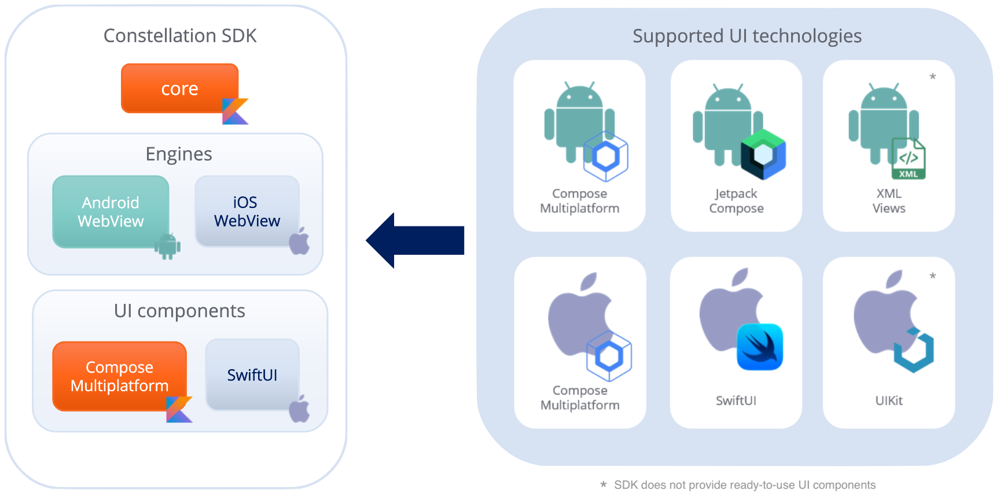
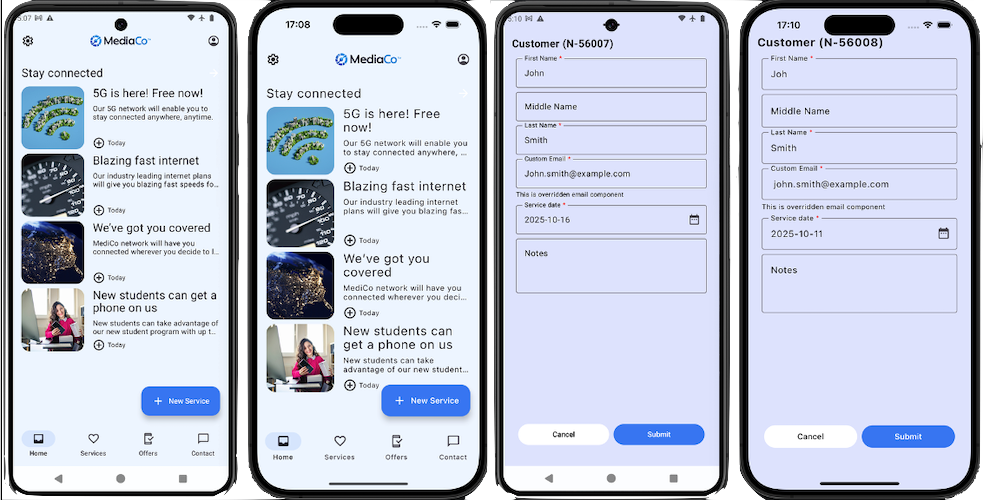
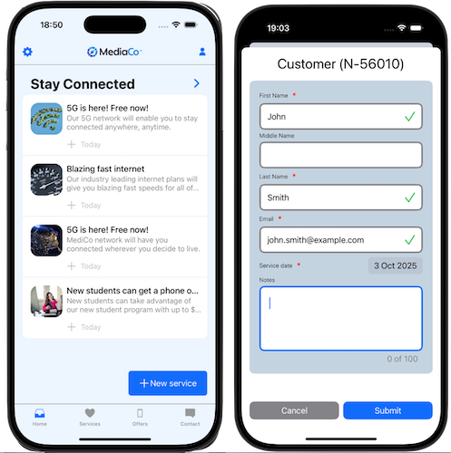

# Pega Constellation Mobile SDK

## Overview

The **Pega Constellation Mobile SDK** is designated for Native Android and iOS applications.
It allows to embed Pega form into existing application with the possibility of using customized UI.

The SDK allows developers to:
- register their implementations for custom components
- provide implementations for Pega components not yet available in the SDK
- register overrides for existing components

It utilizes Constellation JavaScript library and JavaScript components logic.
By default the SDK uses hidden WebView as the JavaScript execution engine.

## Supported Pega use-case

Currently SDK supports creating new case of given type and processing assignment.

## Supported components
The SDK provides following components out-of-the-box:
- **Fields**: 
  - Checkbox, Currency, Date, DateTime, Decimal, Dropdown, Email, Integer, Phone, RadioButtons, TextArea, TextInput, Time, Url
- **Containers**: 
  - Assignment, AssignmentCard, DefaultForm, FlowContainer, Region, RootContainer, View, ViewContainer
- **Other**: 
  - ActionButtons, AlertBanner

## Architecture

The SDK is implemented using Kotlin Multiplatform technology. It allows to share common code between multiple platforms.

The SDK consists of several modules:
- **core**: Contains core SDK logic, configuration and component abstractions. It is platform-independent and shared between all supported platforms.
- **engine**: Contains platform-specific engine implementations, which use Constellation CoreJS library that orchestrates the application logic.
- **samples**: Contains sample applications for Android and iOS platforms.
- **ui**: Contains UI components for supported UI technologies.

The SDK supports following UI technologies:
- **Android**: Compose Multiplatform, Jetpack Compose, XML/Views (*)
- **iOS**: Compose Multiplatform, SwiftUI, UIKit (*)

*\* SDK does not provide out-of-the-box components for these UI technologies*

## Get started ##
- [Getting started with the SDKs](https://docs.pega.com/bundle/constellation-sdk/page/constellation-sdks/sdks/installing-configuring-constellation-sdks.html)
- [Quick start with Constellation SDK](docs/quick-start.md)

## Integration with existing applications
- [Integration with Android applications](samples/android-cmp-app/README.md#integration-with-existing-application)
- [Integration with iOS applications using Compose Multiplatform](samples/ios-cmp-app/README.md#integration-with-existing-application)
- [Integration with iOS applications using SwiftUI](samples/swiftui-components-app/README.md#multiplatform-framework)

## Running sample applications
- [Setting up sample Pega application](docs/setup-sample-pega-app.md)
- [Configuring sample mobile applications](docs/configure-sample-mobile-apps.md)
- [Running Android sample application](samples/android-cmp-app/README.md)
- [Running iOS sample application using Compose Multiplatform](samples/ios-cmp-app/README.md)
- [Running iOS sample application using SwiftUI](samples/swiftui-components-app/README.md)

## Screenshots

### Sample apps using Compose Multiplatform (Android and iOS)

### Sample app using SwiftUI (iOS)

## License

Sources of this repository are licensed using [**Apache 2 license**](./LICENSE).
