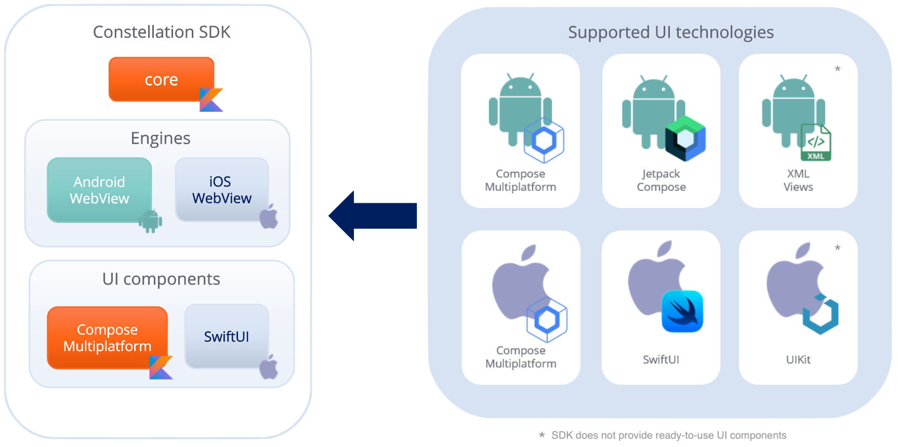
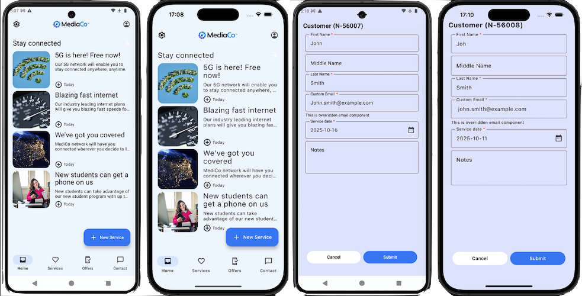
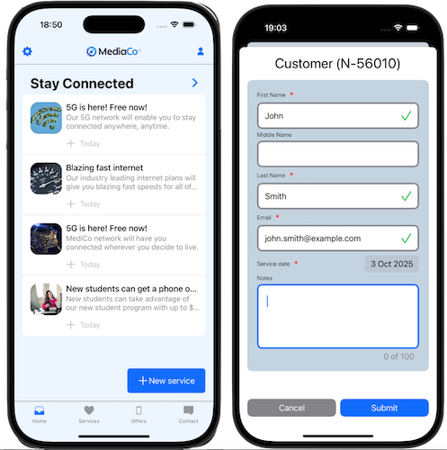

# Pega Constellation Mobile SDK

## Overview

The **Pega Constellation Mobile SDK** is designated for Native Android and iOS applications.
It allows to embed Pega form into existing application with the possibility of using customized UI.

Currently Pega 24 and Pega 25 are supported.

The SDK allows developers to:
- register their implementations for custom components
- provide implementations for Pega components not yet available in the SDK
- register overrides for existing components

It utilizes Constellation JavaScript library and JavaScript components logic.
By default the SDK uses hidden WebView as the JavaScript execution engine.

## Supported Pega use-case

Currently, the SDK supports creating cases of a specified type, opening and processing assignments.

## Supported components
The SDK provides following components out-of-the-box:
- **Simple fields**: 
  - Checkbox, Currency, Date, DateTime, Decimal, Dropdown, Autocomplete, Email, Integer, Phone, RadioButtons, TextArea, Richtext (readonly), TextInput, Time, Url
- **Advanced fields**:
  - EmbeddedData
  - DataReference
    - Single record
      - Displayed as "SimpleTable", "Table", "Dropdown", "Autocomplete" - supported
      - Displayed as "Search and select", "Cards" - not supported
      - Read-Only mode
        - Display as "Read-only field" - supported
    - List of records
      - Displayed as "SimpleTable", "Table", "Combo-box", "Checkbox Group" - supported
      - Displayed as "Search and select", "Cards" - not supported
      - Read-Only mode
        - Displayed as "Read-only field", "Table", "SimpleTable" - supported
        - Displayed as "Map", "Cards" - not supported
    - Many to many - not supported
  - Details template view
- **Containers**: 
  - Assignment, AssignmentCard, DefaultForm, FlowContainer, Region, RootContainer, View, ViewContainer, Field Group
- **Other**: 
  - ActionButtons, AlertBanner

## Architecture

The SDK is implemented using Kotlin Multiplatform technology. It allows to share common code between multiple platforms.

The SDK consists of several modules:
- **core**: Contains core SDK logic, configuration and component abstractions. It is platform-independent and shared between all supported platforms.
- **engine**: Contains platform-specific engine implementations, which use Constellation CoreJS library that orchestrates the application logic.
- **samples**: Contains sample applications for Android and iOS platforms.
- **ui**: Contains UI components for supported UI technologies.

The SDK supports following UI technologies:
- **Android**: Compose Multiplatform, Jetpack Compose, XML/Views (*)
- **iOS**: Compose Multiplatform, SwiftUI, UIKit (*)

*\* SDK does not provide out-of-the-box components for these UI technologies*

## How to integrate existing mobile applications with the SDK ##
- [How to integrate Compose Multiplatform App with Constellation SDK](docs/how-to-integrate-compose-multiplatform.md)
- [How to integrate Android Compose App with Constellation SDK](docs/how-to-integrate-android-compose.md)
- [How to integrate IOS Swift App with Constellation SDK](docs/how-to-integrate-ios-swiftui.md)

## Running SDK Sample applications
- [Setting up sample Pega application](docs/setup-sample-pega-app.md)
- [Configuring sample mobile applications](docs/configure-sample-mobile-apps.md)
- [Running Android sample application using Compose Multiplatform](samples/android-cmp-app/README.md)
- [Running iOS sample application using Compose Multiplatform](samples/ios-cmp-app/README.md)
- [Running Android sample application using Jetpack Compose](samples/android-compose-app/README.md)
- [Running iOS sample application using SwiftUI](samples/swiftui-components-app/README.md)

## Screenshots

### Sample apps using Compose Multiplatform (Android and iOS)

### Sample app using SwiftUI (iOS)

## License

Sources of this repository are licensed using [**Apache 2 license**](./LICENSE).
